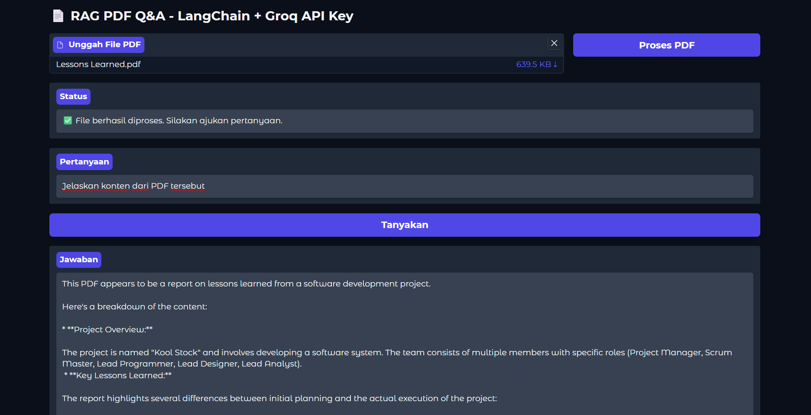

<h1 align="center"> Retrieval-Augmented Generation with Gradio and Groq API Key</h1>
<p align="center"> Natural Language Processing Project</p>

<div align="center">


</div>

### Name : Muhammad Fatih Zain
### Tech Stack : Python, Gradio, LangChain, HuggingFace Embedding, FAISS vector store

---

### 1. Analysis about how the project works
This project implements a Retrieval-Augmented Generation (RAG) system that enhances large language model responses with relevant document context. The application leverages several key technologies:

- **LangChain** as the orchestration framework that connects document processing, retrieval, and generation components
- **PyPDF** for extracting text content from uploaded PDF documents
- **HuggingFace Embeddings** (specifically the all-MiniLM-L6-v2 model) to convert text chunks into vector representations
- **FAISS** vector store for efficient similarity search and retrieval of relevant document chunks
- **Groq API** to access powerful language models like LLaMA 3.3, DeepSeek, and Gemma for generating accurate responses
- **Gradio** for building a clean, interactive web interface

#### System Workflow:
1. **Document Processing**: When a user uploads a PDF, the system:
   - Extracts text content using PyPDFLoader
   - Splits the document into smaller chunks (1000 characters with 200 character overlap)
   - Converts these chunks into vector embeddings using the HuggingFace model

2. **Query Processing**: When a user asks a question:
   - The system converts the query into a vector embedding
   - FAISS retrieves the 4 most semantically similar document chunks
   - These relevant chunks are passed as context to the chosen language model
   - The language model generates a response that's grounded in the document content

3. **User Experience**: Through the Gradio interface, users can:
   - Upload any PDF document as a knowledge source
   - Process the document with a single click
   - Ask questions about the document's content
   - Receive contextually relevant answers derived from the document

This RAG approach significantly improves answer quality by ensuring the language model has access to the most relevant information when generating responses, rather than relying solely on its pre-trained knowledge.

#### Testing Prompt:
To ensure fair comparison between models, we employed a consistent test question across all evaluations:
> **"Jelaskan konten dari PDF tersebut"**

We gathered responses using various temperature settings to analyze how this parameter affects output quality and variability.

---

### 2. Analysis about how different every model works on Retrieval-Augmented Generation

```python
def get_llm():
    return ChatGroq(
        groq_api_key=GROQ_API_KEY,
        model_name="llama-3.3-70b-versatile", # Change the model in the code
        temperature=0.2
    )
```
- Model used : ```[llama-3.3-70b-versatile, deepseek-r1-distill-llama-70b, gemma2-9b-it]```

2.1 **llama-3.3-70b-versatile** :

This model demonstrates excellent document comprehension capabilities with strong contextual understanding. At temperature 0.2, it produced a highly structured response with clear section organization and precise information extraction. The summary was concise yet thorough, capturing key points about project management lessons, role distribution differences, and disparities between theory and practice.

At temperature 0.8, the model maintained accuracy while adopting a slightly more conversational tone. It included additional contextual phrases like "tampaknya merupakan" and offered more descriptive transitions between sections. The higher temperature setting allowed for some natural variability in expression while still maintaining the factual integrity of the document content.

**Temperature: 0.2**


**Temperature: 0.8**


2.2 **deepseek-r1-distill-llama-70b** :

The deepseek model demonstrates a unique analytical approach to document summarization. At temperature 0.2, it organizes information methodically with clear categorical structuring, presenting content with numerical markers and precise subheadings that faithfully mirror the document's organization. The model excels at technical information extraction, capturing specific terminology like "story point," "workload," and implementation details with high accuracy.

At temperature 0.8, the model shows increased contextual awareness by incorporating metadata elements (author name, year, project name) that weren't emphasized at lower temperatures. Its higher-temperature responses include more attributive phrasing and document-level framing. The model maintains excellent factual consistency across temperature settings but demonstrates more flexibility in presentation format at 0.8, with slightly more elaborative connecting language between concept transitions.

**Temperature: 0.2**


**Temperature: 0.8**


2.3 **gemma2-9b-it** :

Gemma2-9b-it delivers impressive document summarization despite its smaller parameter size compared to the 70B models. At temperature 0.2, the model produces a concise, focused summary with excellent information hierarchy, organizing content clearly with bolded headers and bullet points. It efficiently extracts key concepts and technical details while maintaining strong signal-to-noise ratio, effectively prioritizing the most relevant information from the document.

At temperature 0.8, the model adopts a more narrative approach with enhanced meta-commentary, adding interpretive framing elements like "appears to be" and "presents a reflective analysis." The higher temperature setting introduces more varied sentence structures and transitional phrases while maintaining factual accuracy. Despite being significantly smaller than the other models, gemma2-9b-it demonstrates remarkable efficiency in document comprehension, effectively balancing detail retention with concise presentation across both temperature settings.

**Temperature: 0.2**


**Temperature: 0.8**



### 3. Analysis about how temperature works

```python
def get_llm():
    return ChatGroq(
        groq_api_key=GROQ_API_KEY,
        model_name="llama-3.3-70b-versatile",
        temperature=0.2 # Change the temperature value here and analzye
    )
```

3.1 Analysis on higher temperature (0.8)

Higher temperature (0.8) settings produce more varied and nuanced responses with different characteristics across the tested models:

- **More interpretive framing** - Models add contextual phrases like "appears to be" and "this seems to indicate," showing less certainty but more interpretive depth.

- **Enhanced narrative flow** - Responses include more transitional elements and connecting language between concepts, creating a more cohesive reading experience.

- **Document-level awareness** - Models frequently reference the document as a whole ("this PDF presents a reflective analysis") rather than just reporting content.

- **Metadata inclusion** - Higher temperatures often capture peripheral information like document titles, authors, and dates that lower temperatures might omit.

- **Varied sentence structures** - Responses demonstrate greater linguistic diversity with more complex sentence structures and descriptive language.

This setting is particularly valuable for:

- Creating engaging, readable summaries for human consumption
- Generating content that requires interpretive analysis
- Educational contexts where explanatory richness benefits understanding
- Scenarios where slight extrapolation from the text is acceptable

3.2 Analysis on lower temperature

Lower temperature (0.2) settings produce more deterministic, focused responses with certain advantages:

- **Enhanced information hierarchy** - Models create clearer organizational structures with consistent formatting of headers, bullet points, and numbered lists.
- **Higher signal-to-noise ratio** - Responses contain fewer interpretive phrases and focus more directly on core information extraction.
- **Consistent terminology preservation** - Technical terms and specific vocabulary from the source document are more reliably maintained.
- **Factual precision** - Information is presented with fewer qualifying statements or hedges, favoring direct representation of document content.
- **Structured categorization** - Content is more likely to be organized according to the document's original structure rather than being reorganized based on thematic connections.

This setting performs best for:

- Technical documentation summaries requiring precision
- Fact extraction tasks where accuracy is paramount
- Reference materials where consistent formatting matters
- Professional contexts requiring objective reporting without interpretive elements
- Applications where reproducible, predictable outputs are essential

### 4. How to run the project

- Clone this repository with : 

```git
git clone https://github.com/arifian853/RAG_with_GroqAPI.git
```

- Copy the ```.env.example``` file and rename it to ```.env```

```
GROQ_API_KEY=your-groq-api-key
```

- Fill the ```GROQ_API_KEY``` with your Groq API Key, find it here : https://console.groq.com/keys

- Create and activate a virtual environment:
```bash
python -m venv venv
.\venv\Scripts\activate  # On Windows
source venv/bin/activate  # On Unix/MacOS
```

- Install the required dependencies:
```bash
pip install -r requirements.txt
```

- Run the application:
```bash
python app.py
```

- Navigate to the URL shown in the terminal (http://localhost:7860) on your web browser
